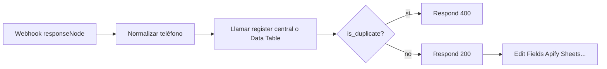

# Flujos proveedor (200 / 400) vs central `prosegur-phone-register`

## Roles

| Pieza | Responsabilidad |
|--------|------------------|
| **`prosegur-phone-register`** | Registrar **siempre** (nuevo o duplicado). Responde **200** con `is_duplicate: true/false`. No decide la respuesta al proveedor externo. |
| **Flujo proveedor** (ej. `MPA-APIFY_Antevenio B2B`) | Hablar con el proveedor: **200** si aceptáis el lead, **400** si duplicado. Parar el flujo antes de Apify/Sheets/email. |

## Ejemplo revisado: `MPA-APIFY_Antevenio B2B`

- ID: `xzKegSHCbJBlL50o`
- Entrada: **Webhook** → **Edit Fields** → waits, Apify, Google Sheets, email, etc.
- Hoy **no** hay nodo `Respond to Webhook`: el proveedor suele recibir **200 al terminar todo el flujo** (o al aceptar el POST), no al inicio. Por eso un duplicado no se puede cortar tarde: hay que decidir **antes** de Apify/Sheets.

## ¿Consultar el Data Store en el webhook inicial?

**No dentro del nodo Webhook** (no tiene lookup). **Sí justo después**, como **primeros nodos** del flujo:



### Requisitos en n8n

1. Webhook en modo **Respond to Webhook** (`responseMode: responseNode`).
2. Rama duplicado: **Respond 400** y **sin** conexión al resto.
3. Rama OK: **Respond 200** y luego el flujo actual (Edit Fields, etc.).

## Dos formas de implementar el “registro”

### A) Recomendada: HTTP al central (una lógica)

1. Tras el Webhook, **HTTP Request** (sync) a `prosegur-phone-register` con `phone`, `source`, header secreto.
2. Leer JSON: `is_duplicate`.
3. **IF** `is_duplicate` → Respond **400** `duplicated phone, not processed`.
4. **ELSE** → Respond **200** → continuar.

Ventaja: un solo sitio para normalización España, histórico y log de duplicados (hoy vía `staticData` en el central; luego Data tables).

### B) Data Table / Data Store en cada flujo proveedor

1. Tras el Webhook, nodo **Data table** (Get / If row exists).
2. IF existe → 400; si no → Insert fila → 200 → continuar.

Ventaja: sin HTTP extra. Inconveniente: repetir normalización y reglas en **cada** flujo; dos proveedores a la vez pueden pasar el IF si no hay un único “claim” atómico.

**Recomendación:** **A** para Prosegur (muchos proveedores). **B** solo si un flujo aislado y volumen bajo.

## Contrato del central (para el IF del proveedor)

Siempre **HTTP 200** (salvo 401/422):

```json
{
  "ok": true,
  "recorded": true,
  "is_duplicate": false,
  "phone_digits": "34612345678",
  "source": "antevenio_b2b",
  "claimed_at": "..."
}
```

Duplicado:

```json
{
  "ok": true,
  "recorded": true,
  "is_duplicate": true,
  "phone_digits": "34612345678",
  "source": "otro_proveedor",
  "first_source": "antevenio_b2b",
  "first_seen_at": "..."
}
```

El flujo proveedor **no** usa el 200 del central como respuesta al proveedor externo: hace su propio **Respond to Webhook** 200/400.

## Orden al tocar `MPA-APIFY_Antevenio B2B`

1. Cambiar Webhook a **Respond to Webhook**.
2. Insertar normalización + llamada al central **entre** Webhook y Edit Fields.
3. Ramas 400 / 200 como arriba.
4. Probar: mismo teléfono dos veces → segundo POST debe recibir **400** sin filas nuevas en Sheet.
